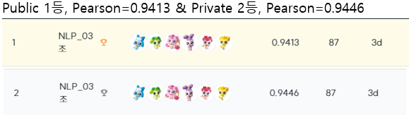

**NLP-03조 반반치킨**의 NLP Level 1 project입니다.

# I. 프로젝트 소개

| 특징 | 설명 |
| --- | --- |
| 대회명 | 네이버 부스트캠프 AI-Tech 7기 NLP트랙의 level1 도메인 대회 |
| 대회 주제 | STS(Semantic Text Similarity)는 두개의 문장이 주어졌을 때 이 문장쌍이 얼마나 의미적으로 유사한지를 판단하는 NLP Task이다. |
| 대회 기간 | 2024.09.11 10:00~ 2024.09.26 19:00 |
| 대회 방식  | Kaggle과 Dacon과 같이 Ai stages에서 리더보드의 Competition형태 |
| 데이터 구성 | 국민청원게시판 제목 데이터, 네이버 영화 감성분석 코퍼스, 업스테이지 slack 데이터의 문장으로 구성되어있다. 
- 총 데이터 개수 : 9,874 문장 쌍
- Train 데이터 개수: 9,324
- Dev 데이터 개수: 550 |
| 평가지표 | 피어슨 상관계수(Pearson Correlation Coefficient) |

저희는 여러가지 모델, 하이퍼파라미터 등을 조합해서 다양하게 실험해보기 위해 NLP-11조에서 제공해주신 템플릿(https://stages.ai/competitions/327/board/community/post/2820)을 기반으로 모듈화하였습니다. 모델, 데이터셋, 손실함수 등의 구성요소들을 모듈화하여 수정이 필요한 부분 외의 코드는 유지할 수 있도록 하였습니다. `config.yaml`  파일을 이용하여 학습, 예측 시에 전달할 인자들을 정의하여 다양한 조합의 모델링 실험을 진행할 수 있습니다.

# II. 사용법

### 0. config.yaml 설정

- `config.yaml` 파일에서 `pwd` 값을 현재 작업 중인 디렉토리 위치로 변경하셔야 합니다. `pwd`는 현재 디렉토리의 경로를 출력하는 명령어로, 이를 사용해 쉽게 확인하실 수 있습니다.
- 데이터 폴더를 템플릿 디렉토리 안으로 이동시켜야 합니다. 이때, 데이터 폴더 이름은 *data*로 지정하는 것이 좋습니다.
- Hugging Face 명령줄 인터페이스에 로그인해야 합니다. `huggingface-cli login` 명령을 실행한 후, API 토큰을 입력하시면 됩니다.
- 사용하는 모델에 맞게  `config.yaml` 파일에서 `type` 부분에  ‘STSModel’ 과 같이 변경해주시면 됩니다.
- wandb를 사용할 경우, `config.yaml` 파일에서 `wandb.project_name`을 적절하게 설정해야 합니다.

```yaml
pwd: /data/ephemeral/home/pytorch-template

name: STS

arch:
  type: STSModel
  args:
    plm_name: monologg/koelectra-base-v3-discriminator

data_module:
  type: DataModule
  args:
    plm_name: ${arch.args.plm_name}
    dataset_name: STSDataset
    batch_size: 16
    shuffle: true
    ...
    max_length: 160
    col_info:
      label: label
      input: [sentence_1, sentence_2]

optimizer:
  type: AdamW 
  args:
    lr: 0.00002
    weight_decay: 0
    amsgrad: true

loss: l1_loss
metrics: [
  pearson
]

```

## 1. Hyper-Parameters Search with Sweep

기존의 [train.py](http://train.py) 코드를 변형하여 WandB Sweeps을 연결하고 다양한 하이퍼파라미터를 실험했습니다.

### 1-1. Sweep 설정 파일 작성

[`find.py`](http://find.py) 파일에 main 부분 중 `sweep_config` 에서 탐색할 하이퍼파라미터와 범위를 지정합니다. `learning_rate`, `batch_size`, `dropout_rate`  등의 파라미터를 추가하거나 주석 처리 등을 통해 파라미터를 정합니다.

```python
if __name__ == "__main__":
    sweep_config = {
        "name": "SLMSTS",
        "method": "random",  # 또는 'bayes'
        "metric": {"name": "val_pearson", "goal": "maximize"},
        "parameters": {
            "learning_rate": {
                "distribution": "uniform",  # 또는 'log_uniform'
                "min": 0.000001,
                "max": 0.00005,
            },
            "batch_size": {"values": [32, 64]},  # 모델에 따라 다르게 설정
            "dropout_rate": {"values": [0.1, 0.2, 0.3]},

            # 'optimizer': {
            #     'values': ['adam', 'adamw']
            # },
            # 'lr_scheduler': {
            #     'values': [50, 100]
            # },

            "weight_decay": {
                "distribution": "uniform",
                "min": 0.000001,
                "max": 0.00005,
            },
            "lora_r": {"values": [32, 64]},
            "lora_alpha": {"values": [8, 16, 32]},
            "lora_dropout": {"values": [0.05, 0.1, 0.2]},
        },
    }
```

### 1-2. WandB config 수정

`wandb_config`에  `sweep_config` 추가한 파라미터를 아래와 같이 추가해줍니다.

```python
def main(config):
    config.pwd = os.getcwd()
    config.wandb.enable = True
    with wandb.init():
        wandb_config = wandb.config
        # ---------------------------------Connect----------------------------------------
        config.data_module.args.batch_size = wandb_config.batch_size
        config.optimizer.args.lr = wandb_config.learning_rate
        config.optimizer.args.weight_decay = wandb_config.weight_decay
        # config.arch.args.dropout_rate = wandb_config.dropout_rate
        config.arch.args.lora_r = wandb_config.lora_r
        config.arch.args.lora_alpha = wandb_config.lora_alpha
        config.arch.args.lora_dropout = wandb_config.lora_dropout
        # --------------------------------------------------------------------------------
```

### 1-3. Sweep 설정

WandB와 연결하기 위해  `project` 에 원하는 프로젝트 명을 설정하고, `count` 에  Sweep을 몇 번 실행할지 변경합니다. wandb.agent()를 통해 정의된 실험 반복 실행합니다.

```python
sweep_id = wandb.sweep(sweep_config, project="프로젝트명")
wandb.agent(sweep_id, function=main, count=15)
```

## 2. Best Ensemble Combination Search

주어진 최선의 앙상블 조합을 찾아보기 위해서는 [`ensemble.py`](http://ensemble.py) 를 실행시켜 확인하실 수 있습니다. 

## 3. LLM Classifier with QLoRa

NLP-11조의 베이스라인 코드에서 LLM이 사용될 수 있도록 QLoRa 세팅을 추가하고 모델 타입과 collate 부분을 수정했습니다.

```python
class SLMModel(nn.Module):
    def __init__(self, plm_name, dropout_rate, lora_r, lora_alpha, lora_dropout):
        super().__init__()

        # BitsAndBytesConfig
        bnb_config = transformers.BitsAndBytesConfig(
            load_in_4bit=True,
            bnb_4bit_use_double_quant=True,
            bnb_4bit_quant_type="nf4",
            bnb_4bit_compute_dtype=torch.float16,
        )
        # LoraConfig
        lora_config = LoraConfig(
            task_type=TaskType.SEQ_CLS,
            inference_mode=False,
            r=lora_r,
            lora_alpha=lora_alpha,
            lora_dropout=lora_dropout,
            target_modules=["q_proj", "v_proj"],
        )

        self.plm = transformers.AutoModelForSequenceClassification.from_pretrained(
            pretrained_model_name_or_path=plm_name,
            num_labels=1,
            use_auth_token=False,
            quantization_config=bnb_config,
            device_map="auto",
        )
        # k-bit 훈련 준비
        self.plm = prepare_model_for_kbit_training(self.plm)
    
        # for name, param in self.plm.named_parameters():
        #     if name == 'score.weight' in name:
        #         param.requires_grad = True 
        #     else:
        #         param.requires_grad = False 
    
        # LoRA 적용
        self.plm = get_peft_model(self.plm, lora_config)
    def forward(self, x):
        outputs = self.plm(x)
        return outputs.logits.squeeze(-1)
```

## 4. Data augmentation

- 데이터 증강을 수행하는 과정을 모듈화하였습니다.

### 4-0. Setting

- 증강할 데이터셋을 `data_augmentation/aug_data`디렉토리 내에 `csv` 파일로 추가해야 합니다.

### 4-1. preprocessing

- 데이터셋 전처리를 수행하는 코드입니다.
    - HTML 태그 제거, 웃음 표현 통일, 특수문자 제거 등의 전처리를 수행합니다.
- `input_file` 에 원본 파일 경로를, `output_file` 에 저장할 파일 경로를 설정합니다.

### 4-2. re-label

- 데이터 증강을 위해 라벨링을 새로 하는 코드입니다.
    - 새로운 라벨에 맞게 기존 라벨을 가장 가까운 라벨로 할당합니다.
- `input_file` 에 원본 파일 경로를, `output_file` 에 저장할 파일 경로를 설정합니다.
- `new_labels` 에 새롭게 지정할 라벨을 설정합니다.

### 4-3. aug1_swap

- sentetce_1과 sentence_2의 위치를 바꾸어 데이터를 증강하는 코드입니다.
- `input_file` 에 원본 파일 경로를, `output_file` 에 저장할 파일 경로를 설정합니다.
- 리스트 형식으로 `label_values` 에 증강이 필요한 라벨을, `sample_sizes`  에 각각 필요한 증강 개수를 설정합니다.

### 4-4. aug2_copy

- label이 5가 아닌 데이터셋에서 하나의 문장을 sentence_1과 sentence_2에 추가하여 데이터를 증강하는 코드입니다.
- `input_file` 에 원본 파일 경로를, `output_file` 에 저장할 파일 경로를 설정합니다.
- 리스트 형식으로 `label_values` 에 증강이 필요한 라벨을, `sample_sizes`  에 각각 필요한 증강 개수를 설정합니다.

### 4-5. aug3_sr

- 유의어 사전을 바탕으로 유의어를 교체하여 데이터를 증강하는 코드입니다.
- `input_file` 에 원본 파일 경로를, `test_file` 에 테스트 파일 경로를, `output_file` 에 저장할 파일 경로를 설정합니다.
- 리스트 형식으로 `label_values` 에 증강이 필요한 라벨을, `sample_sizes`  에 각각 필요한 증강 개수를 설정합니다.
- `test_file` 을 확인하여 유의어 교체가 정상적으로 이루어졌는지 확인하고, 필요에 따라 유의어 사전의 key를 추가, 제거, 변형할 수 있습니다.

### 4-6. combine

- 동일한 양식의 두 `csv` 파일을 병합하는 코드입니다.
- 증강된 데이터는 새로운 `csv` 파일로 반영되기 때문에 해당 코드를 활용하여 데이터셋을 병합해야 합니다.

## 5. 추가

- `find.py`를 실행한 후 val_pearson이 높은 순으로 saved 폴더 안에 모델이 저장됩니다.
- `test.py`을 실행하면 train/dev/test dataset에 대한 예측값이 `output` 폴더 안에 저장됩니다. 이때,`checkpoint_path` 변수에 checkpoint 경로를 넣어줘 테스트에 사용되는 모델을 지정해줘야 합니다.

### Template structure

```
pytorch-template
├── base/
|   ├── base_data_loader.py
|   ├── base_dataset.py
|	  └── base_trainer.py
├── module/
|   ├── dataset.py              # dataset class 구현
|   ├── loss.py                 # loss function 구현
|   ├── matric.py               # matric function 구현
|   ├── trainer.py              # trainer class
│   └── model.py                # model class 구현
├── data_augmentation/
|   ├── aug_data/
|   |   ├── pickle/ 
|   |   |   ├── new.pickle      # 유의어 사전
|   |   |   └── new_pickle.txt  # 사전 확인용 파일
|   |   └── aug.csv             # 증강할 원본 데이터
|   ├── preprocessing.ipynb     # 데이터 전처리
|   ├── re-label.ipynb          # 데이터 re-labeling
|   ├── aug1_swap.ipynb         # sentence swap 증강
|   ├── aug2_copy.ipynb         # sentence swap 증강
│   └── aug3.sr.ipynb           # 유의어 교체 증강
├── data_au
├── config.yaml                 # configuration file
├── saved/                      # 모델 저장 폴더
├── output/                     # 추론 결과 폴더
├── .gitignore
├── README.md
├── reqirements.txt
├── test.py                     # 모델 추론
├── find.py                     # Wandb Sweep 하이퍼파리미터 Search
├── train.py                    # 모델 학습 및 저장
└── utils.py

```

# III. 출처

https://stages.ai/competitions/327/board/community/post/2820

https://huggingface.co/

https://kr.wandb.ai/

# IV. project result

.
